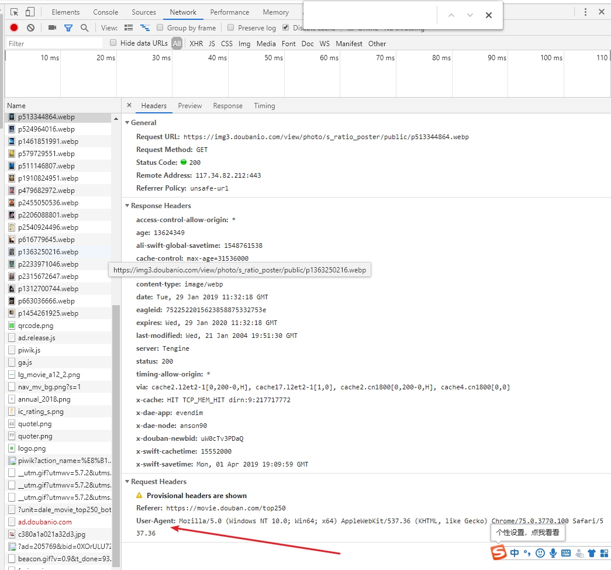
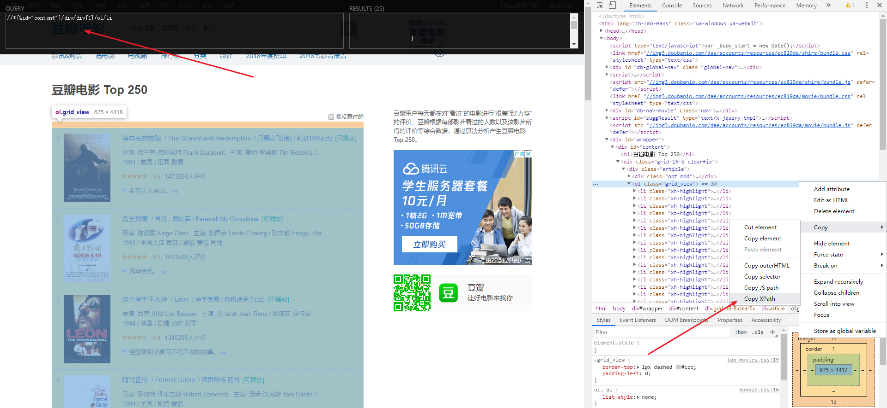

# 本文将带领读者以最快的速度开始网络爬虫,前提条件为 Python 入门

## 1.安装 Scrapy

```python
pip install Scrapy
```

## 2.创建项目

```python
scrapy startproject 项目名
```

## 3.生成爬虫逻辑文件，在里面编写爬虫逻辑，注意：爬虫名不能与项目名称重复

```python
#scrapy genspider 自定义爬虫名 域名
#eg:
scrapy genspider douban_spider movie.douban.com
```

## 4.在爬虫项目中的 items.py 中明确抓取信息的目标，定义字段

```python
# eg:
class TutorialItem(scrapy.Item):
    # define the fields for your item here like:
    # name = scrapy.Field()
    # 序号
    serial_number = scrapy.Field()
    # 电影的名称
    moive_name = scrapy.Field()
    # 电影介绍
    introduce = scrapy.Field()
    # 电影星级
    star = scrapy.Field()
    # 电影描述
    des = scrapy.Field()

```

## 5.编写爬虫逻辑,就是之前的生产的爬虫逻辑文件中,编写好后即可在当前文件目录下运行 scrapy crawl douban_spider,你应该会发现 403 错误，出现错误的原因是 settings 文件中的 USER_AGENT 没有设置，后面我将会对 Settings 文件做详细的介绍，将浏览器中的 USER-AGENT 复制到 Settings 中的 USER_AGENT，这里便完成了页面的 html 文本信息

```python
class DmozSpider(scrapy.Spider):
    # 爬虫名
    name = "douban_spider"
    # 允许的域名
    allowed_domains = ["movie.douban.com"]
    # 入口url,扔到调度器里面
    start_urls = [
        "https://movie.douban.com/top250"
    ]

    # 解析页面
    def parse(self, response):
        # 返回页面html
        print(response.text)
```



## 6.通过 xPath 提取信息,快速查看 Xpath 工具:Xpath-helper,可在谷歌扩展程序商店下载.

### 秘籍！！！复制粘贴，如果想不写 Xpath，也懒得去想，则可以用以下方式复制，再粘贴到 Xpath 查看工具中看是否正确。



## 7. 通过 Xpath 得到想要信息

```python
 # 解析页面
    def parse(self, response):
        movie_list=response.xpath("//*[@id='content']/div/div[1]/ol/li")
        for i in movie_list:
        # 这里返回的是我们想要的数据的所有li
            print(i)

```

## 8.进一步抽取我们想要的信息，序号，名称，评论等等.extract_first():首条数据。注：前面我们拿到了 movie_list,想要在此基础后面接着写 xpath 需要在新的 xpath 前加上'.'

```python
# 解析页面
    def parse(self, response):
        movie_list = response.xpath("//*[@id='content']/div/div[1]/ol/li")
        for item in movie_list:
            douban = TutorialItem()
            douban["serial_number"] = item.xpath(
                './div/div[1]/em/text()').extract_first()
            douban["moive_name"] = item.xpath(
                './div/div[2]/div[1]/a/span[1]/text()').extract_first()
            content = item.xpath(
                './div/div[2]/div[2]/p[1]/text()[2]').extract_first()
            # 去除空格
            douban["introduce"] = "".join(content.split())
            douban["star"] = item.xpath(
                './div/div[2]/div[2]/div/span[2]/text()').extract_first()
            douban['des'] = item.xpath(
                './div/div[2]/div[2]/p[2]/span/text()').extract_first()
```

## 9.对下一页进行处理

```python
    # 解析页面
    def parse(self, response):
        movie_list = response.xpath("//*[@id='content']/div/div[1]/ol/li")
        for item in movie_list:
            douban = TutorialItem()
            douban["serial_number"] = item.xpath(
                './div/div[1]/em/text()').extract_first()
            douban["moive_name"] = item.xpath(
                './div/div[2]/div[1]/a/span[1]/text()').extract_first()
            content = item.xpath(
                './div/div[2]/div[2]/p[1]/text()[2]').extract_first()
            # 去除空格
            douban["introduce"] = "".join(content.split())
            douban["star"] = item.xpath(
                './div/div[2]/div[2]/div/span[2]/text()').extract_first()
            douban['des'] = item.xpath(
                './div/div[2]/div[2]/p[2]/span/text()').extract_first()
            # # 返回给pipelines，进行数据清理,存储等
            yield douban
        # 下一页的路径
        next_path = response.xpath(
            "//*[@id='content']/div/div[1]/div[2]/span[3]/a/@href").extract()
        if next_path:
            next_path = next_path[0]
            # 如果路径存在，则一直回调当前方法
            yield scrapy.Request("https://movie.douban.com/top250"+next_path, callback=self.parse)
```

## 10. 存储为 json 和 csv 文件

```python
scrapy crawl 爬虫名 -o test.csv
scrapy crawl 爬虫名 -o test.json
eg : scrapy crawl douban_spider -o test.csv
scrapy crawl douban_spider -o test.json
```

## 11. 使用 MongoDB 进行存储，MongoDB 相对于 mysql 而言，对 json，csv 等格式而言的数据存储更方可视性更友好

1. settings 里面打开 ITEM_PIPELINES, 定义 MongoDB 的参数，需换成自己数据库

```python
ITEM_PIPELINES = {
    'tutorial.pipelines.TutorialPipeline': 300,
}

mongo_host = '47.107.82.160'
mongo_port = 27017
mongo_db_name = 'douban'
mongo_db_collection = 'douban_movie'
```

2. 安装 pip install pymongo

3. 在 pipelines.py 中编写插入数据逻辑

```python
import pymongo
from tutorial.settings import mongo_db_collection, mongo_db_name, mongo_host, mongo_port


class TutorialPipeline(object):
    def __init__(self, *args, **kwargs):
        host = mongo_host
        dbname = mongo_db_name
        sheetname = mongo_db_collection
        port = mongo_port
        client = pymongo.MongoClient(host=host, port=port)
        mydb = client[dbname]
        self.post = mydb[sheetname]

    def process_item(self, item, spider):
        data = dict(item)
        self.post.insert(data)
        return item

```

## 12. 使用中间件代理请求，为什么要这么做呢，在我们平时使用爬虫程序采集数据时，往往会遇到，因采集速度过快导致的自己网络 ip 被目标网站封禁，这种封禁有时候是封几分钟，有时候是封一天，封的时间不等，但是这样会导致我们局域网内其他人也无法访问目标网站，最大的问题是我们无法进行数据采集。为了保证正常采集数据且本地 ip 不被封禁，引入代理 ip。

1. settings 里面设置

```python
DOWNLOADER_MIDDLEWARES = {
    #自己的代理器，写在middlewares.py中
    'tutorial.middlewares.my_proxy': 543,
}

```

2. 代理服务器中间件的编写

```python
# 代理服务器可以去看看阿布云的。
class my_proxy():
    def process_request(self, request, spider):
        request.meta['proxy'] = '代理服务器地址+端口'
        proxy_name_pass = b'通行证书：通行密钥'
        # 加密
        encode_pass_name = base64.b64encode(proxy_name_pass)
        request.headers['Proxy-Authorization'] = 'Basic ' + encode_pass_name.encode()
```

3. 代理 User_Agent 中间件的编写

```python
# Settings里添加中间件
DOWNLOADER_MIDDLEWARES = {
    'tutorial.middlewares.my_proxy': 543,
    # 优先级不能相同
    'tutorial.middlewares.my_useragent': 544
}

# middlewares.py里面编写中间件
class my_useragent():
    def process_request(self, request, spider):
        USER_AGENT_LIST = [
            'MSIE (MSIE 6.0; X11; Linux; i686) Opera 7.23',
            'Opera/9.20 (Macintosh; Intel Mac OS X; U; en)',
            'Opera/9.0 (Macintosh; PPC Mac OS X; U; en)',
            'iTunes/9.0.3 (Macintosh; U; Intel Mac OS X 10_6_2; en-ca)',
            'Mozilla/4.76 [en_jp] (X11; U; SunOS 5.8 sun4u)',
            'iTunes/4.2 (Macintosh; U; PPC Mac OS X 10.2)',
            'Mozilla/5.0 (Macintosh; Intel Mac OS X 10.6; rv:5.0) Gecko/20100101 Firefox/5.0',
            'Mozilla/5.0 (Macintosh; Intel Mac OS X 10.6; rv:9.0) Gecko/20100101 Firefox/9.0',
            'Mozilla/5.0 (Macintosh; Intel Mac OS X 10.8; rv:16.0) Gecko/20120813 Firefox/16.0',
            'Mozilla/4.77 [en] (X11; I; IRIX;64 6.5 IP30)',
            'Mozilla/4.8 [en] (X11; U; SunOS; 5.7 sun4u)'
        ]
        # 随机生成user agent
        USER_AGENT = random.choice(USER_AGENT_LIST)
        request.headers['User_Agent'] = USER_AGENT
```

## 13. 以上就是 Scrapy 的基础内容，接下来将对细节进行详解

### Settings 配置文件详解

```python
#项目名称，默认的 USER_AGENT 由它来构成，也作为日志记录的日志名
BOT_NAME = 'Amazon'
#爬虫应用路径
SPIDER_MODULES = ['Amazon.spiders']
NEWSPIDER_MODULE = 'Amazon.spiders'
#客户端 User-Agent 请求头
USER_AGENT = 'Amazon (+http://www.yourdomain.com)'
#是否遵循爬虫协议
ROBOTSTXT_OBEY = False
#是否支持 cookie，cookiejar 进行操作 cookie，默认开启
COOKIES_ENABLED = False
# Telnet用于查看当前爬虫的信息，操作爬虫等...使用telnet ip port ，然后通过命令操作
TELNETCONSOLE_ENABLED = False
TELNETCONSOLE_HOST = '127.0.0.1's
TELNETCONSOLE_PORT = [6023,]
# Scrapy 发送 HTTP 请求默认使用的请求头
DEFAULT_REQUEST_HEADERS = {
'Accept': 'text/html,application/xhtml+xml,application/xml;q=0.9,\*/\_;q=0.8',
'Accept-Language': 'en',
}
#下载器总共最大处理的并发请求数,默认值16
CONCURRENT_REQUESTS = 32
# 每个域名能够被执行的最大并发请求数目，默认值8
CONCURRENT_REQUESTS_PER_DOMAIN = 16
#如果没有开启智能限速，这个值就代表一个规定死的值，代表对同一网址延迟请求的秒数
DOWNLOAD_DELAY = 3
#是否启用缓存策略
HTTPCACHE_ENABLED = True
#缓存策略：所有请求均缓存，下次在请求直接访问原来的缓存即可
HTTPCACHE_POLICY = "scrapy.extensions.httpcache.DummyPolicy"
#缓存策略：根据Http响应头：Cache-Control、Last-Modified 等进行缓存的策略
HTTPCACHE_POLICY = "scrapy.extensions.httpcache.RFC2616Policy"
#缓存超时时间
HTTPCACHE_EXPIRATION_SECS = 0
#缓存保存路径
HTTPCACHE_DIR = 'httpcache'
#缓存忽略的Http状态码
HTTPCACHE_IGNORE_HTTP_CODES = []
#缓存存储的插件
HTTPCACHE_STORAGE = 'scrapy.extensions.httpcache.FilesystemCacheStorage'

```
