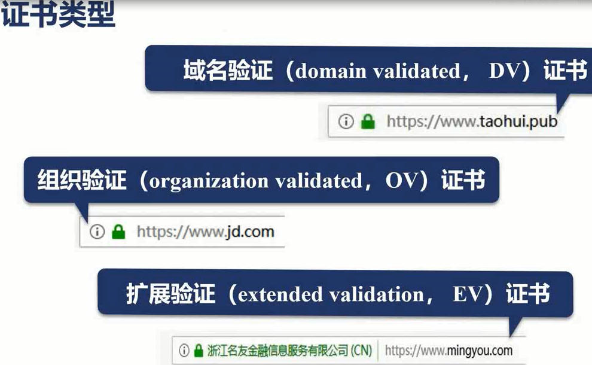

# nginx 从入门到精通

## nginx 下的常用命令

1. nginx -v/V 打印 nginx 的版本信息
2. ./nginx -s reload 重新载入配置文件(在不停止 nginx 服务的情况更新配置)
3. nginx -s stop 立刻停止服务
4. nginx -s quit 优雅的停止服务
5. nginx -s reopen 重新开始记录日志文件
6. nginx -?/h
7. nginx -c 使用指定配置文件
8. nginx -g 指定配置指令
9. nginx -p 指定运行目录
10. nginx -t/T 测试配置文件是否有语法错误

## nginx 热部署

1. 首先通过 ps -ef |grep nginx 查看 nginx 当前进程
2. cp nginx nginx.old 把现有 nginx 二进制文件备份一下，因为编译了新的 nginx 后只更换二进制文件
3. 进入 objs 文件夹 cp -r nginx /usr/local/nginx/sbin/ -f 把新编译好的二进制文件拷贝到 sbin 的目录中替换掉之前的 nginx 二进制文件
4. 给正在运行的 nginx master 进程发送一个信号，告诉它我们进行热部署了，做一次版本升级: kill -USR2 13195(13195 为 nginx master 进程的号),这时候 nginx master 进程会新生成一个 master 进程，这个新的 master 进程使用了刚刚新复制过来 nginx 二进制文件来启动它，老的 worker 也在运行，新的 master 会生成新的 worker,他们会平滑的把所有的请求过度到新的 nginx 二进制文件中
5. 使用 ps -ef|grep nginx 再看一下 nginx 进程状况，可以看到新老的 master 进程和 worker 进程都在运行，但是老的 master 和 worker 都不在监听 80 或者 443 端口了，新的请求，新的连接只会进程新的 nginx 进程中，这个时候我们需要给老的 nginx 进程发送信号，告诉它，请优雅的关闭你的 worker 进程。使用命令：kill -WINCH 13195(进程号)
6. 使用 ps -ef|grep nginx 再看一下 nginx 进程状况，可以看到老的 worker 进程已经退出了，但是老的 master 进程还在，这是为了防止新的 nginx 可能会有一些 bug，这是为了给我们做版本回退，可以给这个进程发送 reload 命令，让他重新把 worker 进程拉起来，再把新版本关掉。就可以版本回退。

## 日志切割

### 当我们需要把以前的日志备份到另外的文件中，但是 nginx 还是正常运行的。

1. 把日志文件复制一份 mv access.log bak.log
2. 执行命令 ../sbin/nginx -s reopen,这时候看下目录会发现 nginx 重新生成了一个日志文件，这样就完成了日志切割。但这样其实很麻烦，可以写一个 bash 脚本来管理。

## 访问静态文件

1. 先确定静态文件目录，最好是绝对路径
2. 配置 Nginx.conf
   - listen :监听端口
   - location :配置地址 + alias :nginx 安装目录下的某某文件夹
     
3. 重新加载:nginx -s reload,注意，这里的配置会默认访问 alias 指定地址下的 index.html 文件
4. 这样方式的加载没有经过 gzip 压缩，经过 gzip 后文件大小会大幅度减少，通常是会打开 gzip
   没经过 gzip 压缩前
5. 打开 gzip
   - gzip on: 打开 gzip 压缩
   - gzip_min_length 1; 最小压缩，小于 1 字节的文件将不进行压缩，因为 http 报文一次就发送出去了，所以没必要压缩
   - gzip_comp_level 2; 压缩级别
   - gzip_tepys text/plain application/x-javascript text/css application/xml text/javascript application/x-httpd-php image/jpeg image/gif image/png :压缩格式，只针对以上格式进行压缩，如果本来就是 gzip 或者没有包含的格式将不进行压缩
     压缩后大小，由此可见访问静态文件时，gzip 还是节约了很大的加载大小。
6. 访问静态目录，主要用于共享资源时方便查看，只需要打开 autoindex 即可
   
   注意：如果该目录下有 index.html 文件，访问时将自动跳转至该页面

## 限制速度

### 因为公网带宽是非常有限的，当并发用户使用我们的带宽时会形成一个增强关系，我们可能会为了让用户访问一些大文件的时候去限制他的速度，以期望能分离出足够的带宽，让用户访问必要的一些小文件，如 css,js 等等，这个时候就可以使用 set \$limit_rate 1k;其中 1K 就表示每秒传输 1Kb 到浏览器中

## 日志格式

1. 在 http 模块下有一个 log_format 指令，由它来定义日志的格式
   
2. 对日志格式进行命名，为了给不同的域名定义不同的日志格式
   
3. 在 server 请求里通过 access_log 定义日志存放在哪里，以及日志格式，每个请求都可以独立设置日志格式以及日志存放目录
   

## 反向代理

### 由于上游服务要处理非常复杂的业务逻辑而且还要强调开发效率，所以性能比较差，nginx 反向代理后，可以由一台 nginx 把请求按照负载均衡算法代理给多台上游服务器工作，这样就实现了水平扩展，在用户无感知的情况下添加上游服务器来提升性能，而当上游服务器出现问题的时候，nginx 可以自动的把请求从有问题，出现灾难的服务器转交给正常的服务器

1. 将 nginx 服务器，变更为上游服务器，通常上游服务器是不可访问的，这个时候可以在 listen 中将端口号变成 127.0.0.1:8080,这时只有本地的进程才可以来打开 8080 端口
   
2. 停掉 nginx，防止之前的进程还可以打开端口：./nginx -s stop,再打开：./nginx
3. 使用 nginx 以外的服务器，如 OpenResty,UWSIG 等等。此处以 uwsig 为例。
   
4. 添加 upstream 上游服务，如果有很多台上游服务可以依次添加到这里。
   
5. proxy_pass 代理地址，当访问 listen 中指定端口时将自动访问到 upstream 上游服务中
   
6. proxy_set_head 特性介绍：起指向作用，因为有了反向代理，在上游服务中取到的地址其实是反向代理这台机器的地址，如果想拿浏览器的地址作为我限制浏览器访问速度等功能的一个作用时，其实是拿不到的。所以通过 proxy_set_head 可以把一些值添加一条新的 header 发送给上游服务器，比如说 X-Real-Ip \$remote_addr,把 X-Real-Ip 的值设置为从远端浏览器上的 IP 地址
   
7. proxy_cache 特性介绍：通常使用 Nginx 反向代理时，只有动态的请求，也就是不同的用户访问同一个 URL 看到的内容是不一样时，这个时候才会交由上游服务器处理，但是有一些内容可能一段时间不会发生变化，这个时候为了减轻上游服务的压力，我们就会让 Nginx 把上游服务器的静态内容缓存一段时间，比如缓存一天，在一天之内，即使上游服务器对这个内容的相应发生了变化我们也不管，我们只会去拿缓存中的内容向浏览器发生相应，因为 Nginx 的性能远远高于上游服务器，所以使用这样的特性，对于一些小的站点，会有非常大的性能提升。
8. 配置缓存服务器
   - 通过 proxy_cache_path 设置缓存路径，其中的 key 值是需要拿去使用的
   - ，意思是开拓了 10m 的共享内容，命名为 my_cache
   - 在需要做缓存的 url 地址下增加 proxyh_cache my_cache 是刚才开辟的共享内存
   - proxy_cache_key : 同一个 url 访问时对不同的用户展示的内容是不一样的，所以用户的变量就需要去放在 key 中，比如$host$uri,另外还加了一些参数$is_args$args,这些参数就指明了是哪个用户，哪些资源，这些作为一个整体的 key。
     
   - proxy_cache_valid : 对于哪些响应不返回
   - 测试：先访问一次站点，然后停掉上游服务，看是否还能访问

## 使用 GoAccess 查看服务器日志动向以及分析

### access 日志记录了 Nginx 非常重要的信息，我们可以用 access 日志分析定位问题，也可以用它来分析用户的运行数据，但是如果想实时分析 access.log 还是非常困难的，通过 GoAccess 可以做到图形化的方式，通过 webSocket 协议，实时把 access.log 的变迁反应到浏览器中，方便我们分析问题.

1. GoAccess 在使用源码安装时，依赖下列组件。
   - 为方便最终日志统计时显示 IP 地理位置，需要安装依赖项 GeoIP-devel：
   - 执行命令：yum install GeoIP-devel.x86_64
   - yum install ncurses-devel
   - yum install tokyocabinet-devel
   - yum install openssl-devel
2. 下载并安装 GoAccess：
   - 通过 cd 命令切换到/usr/local/src 目录下，然后使用 root 权限执行命令:
   - wget http://tar.goaccess.io/goaccess-1.2.tar.gz
   - tar -zvxf ./goaccess-1.2.tar.gz
   - 然后执行 cd ./goaccess-1.2 进入目录。
   - ./configure --enable-utf8 --enable-geoip=legacy
   - make
   - make install
   - ln /usr/local/bin/goaccess /usr/bin/
3. 安装完成后，相关目录：

   - 可执行程序：/usr/local/bin/goaccess
   - 配置文件：/usr/local/etc/goaccess.conf
   - 其它文件：/usr/local/share/doc/goaccess
   - 手册：/usr/local/share/man/man1

4. 执行 goaccess access.log -o ../html/report.html --real-time-html --time-format='%H:%M:%S' --data-format=='%d/%b/%y' --log-format=COMBINED 意思是实时监控 access.log 这个文件，使用-o 这个变量生成新的 html 文件，把当前 access.log 之中的内容以图表的方式展示出来，当 access.log 变迁的时候 goaccess 会新起一个 websocket 进程，将消息推送到客户端

# 从网络原理来看 SSL 安全协议

## SSL 全称 Secure Sockets Layer,SSL3.0 协议是由网景公司在 1995 年推出的，在 3.0 获得了非常大的发展，但是微软把他的 IE 浏览器和系统一起卖出以后，导致网景遇到了很大的困境，网景公司在把 SSL 变相交给微软后，微软在 1999 年把 SSL 改名为 TLS1.0,直到现在已经发展到了 TLS1.3

## 1. TLS 协议是如何保证 http 的明文消息被加密的？以下是 TLS 的通用模型

在 OSI 七层模型中，应用层是 HTTP 协议，在 HTTP 协议之下的表示层，也就是 SSL 协议发挥作用的这一层，他通过握手，交换，告警，加密等方式使 HTTP 层没有感知的情况下做到了数据的安全加密。

## 2. TLS 是怎样做到数据的安全加密的？

当我们抓包或者查看服务器端的配置时，我们可以看到类似这样一张图的配置，这样的一个安全密码的配置决定了 TLS 协议是怎样保障明文被加密的，这里有 4 个组成部分

- 秘钥交换 ECDHE：椭圆曲线加密算法，秘钥交换是为了解决浏览器和服务器之前，怎样各自独立的生成秘钥，而且生成的秘钥是相同的，接下来他们会用这个秘钥去加密数据。
- 秘钥交换过程中需各自验证身份，使用 RSA 身份验证算法。
- 数据加密解密的通讯时会用到对称加密算法：使用 AES,128,GCM 来表达，其中 AES 表示是什么算法，128 为 AES 算法的强度，GCM 为分组模式，它可以提高多核 CPU 加密和解密的性能
- SHA256:是一个摘要算法，用来把不定长度的字符串，生成不定长度更短的摘要.

## 3. 对称加密和非对称加密

### 3.1 对称加密：假设 Bob 和 Alice 需要通过对称加密的方式进行通信，他们共同持有同一把秘钥，Bob 可以把原始明文的文档通过这一把秘钥，加密生成一个密文文档，而 Alice 拿到这个密文文档后，他可以用这把秘钥还原成原始的明文文档，而中间的任何人如果没有持有这把秘钥，即使他知道对称加密的算法，他也没有办法把密文还原成原始文档.

### 3.1.1 对称加密是如何实现的： 我们以 RC4 这样的对称加密算法举个例子:中间的圆形为异或操作，相同和为 0，不相同和为 1。假设 1010 是我们共同持有的秘钥，而 0110 是我们的明文，Bob 执行加密的时候就会得到密文 1100，而异或有一个对称的特性，把密文和秘钥做同样的异或操作，就可以得出明文，说明密文使用同一把秘钥完成可以还原明文。所以对称加密有一个非常好的特点就是性能非常的好，它的解密加密只需要遍历一次就可以得到我们想要的。而非对称加密它的性能就会差很多。

### 3.2 非对称加密： 它根据数学原理生成一对秘钥，公钥和私钥，公钥和私钥的特性是同一份明文文档如果用公钥加密，只有用私钥才能把它解密，同样道理，如果用私钥加密，只有公钥才能解密。

### 3.2.1 非对称加密是如何实现的：比如 Alice 有公钥和私钥，她就可以把她的公钥发送给大家，比如 Bob 是其中一个人，他拿到了 Alice 的公钥，Bob 想传一份原始文档给 Alice,Bob 就会使用 Alice 的公钥对原始文档进行加密，把密文发送给 Alice，Alice 只能拿她的私钥对其解密，其他人用的是公钥都没办法对其解密。

### 3.2.2 公钥的第二种用途：身份验证，比如 Alice 用她的私钥对原始文档进行的加密，然后把密文发给了 Bob,或者任何人，只要 Bob 有 Alice 的公钥，因为公钥本身就是公开的，如果公钥能成功解开这段密文，拿这段密文确实是由 Alice 发出的，这就为我们接下来的 TLS 秘钥交换算法提供了基本的签名保障

## 4. SSL 证书的公信力是如何保证的？

### 4.1 两端通信其实有个前提条件，那就是服务端必须知道信息是由这个客户端发来的，而不是其他的客户端发来的，那这就存在一个信任问题，在多方通信的过程中，必须有一个公信机构，这个公信机构就是 CA 机构。

### 4.2 CA 是如何颁发证书和把证书过期的？

- #### 首先我们需要申请证书，申请证书的过程中我们需要去登记我是谁，我属于什么组织，我想做什么事情，登记机构通过 CSR 发给 CA,CA 中心通过以后会生成一对公钥和私钥，公钥会在 CA 证书里面保存着，订阅人也就是开发者拿到公钥和私钥后需要把他部署到 WEB 服务器中，如 Nginx，当浏览器通过 https 访问我们的站点的时候，浏览器会去请求我们的证书，nginx 服务器会把公钥证书发给浏览器，而浏览器需要去验证我们的证书是不是合法和有效的。CA 颁发的证书一般是 1 年的有效期。
- #### CA 中心会把过期的证书放在 CRL 服务器里面，这个服务器会把所有的过期证书形成一个链条，所以他的性能非常的差，所以它又推出了一个 OCSP 响应程序，它可以就一个证书去查询是否过期，所以浏览器是可以直接去查询 OCSP 响应程序的，但 OCSP 响应程序性能还不是很高，所以 Nginx 有一个 OCSP 响应程序的开关，当我们打开开关时，Nginx 会主动的去 OCSP 查询，这样大量的客户端直接从 Nginx 就可以获取到证书是否有效.

### 4.3 证书的类型

- #### 

### 1. 用作域名验证的 DV 证书，这个证书只会去验证域名的归属是否为正确，只要域名指向的服务器是你正在申请证书的那台服务器，或者验证注册时的邮箱是否正确等等，那就可以成功获取到证书

### 2. 组织验证 OV 证书，就是我们在申请证书的时候会去验证我们填写的机构，企业名称，是否是正确的，所以 OV 证书的申请往往需要几天的时间，不想 DV 证书实时就可以获取到了，而 OV 证书的价格也要远远高于 DV 证书，DV 证书许多都是免费的。

### 3. 更严格的扩展验证 EV 证书，大部分浏览器会对 EV 证书非常的友好，他会把机构名称在浏览器的地址栏中显示出来，而 DV 和 OV 浏览器是没有这个优待的。

### 4.4 证书是如何生效的？

- #### 浏览器从安全的角度来说对 DV,OV,EV 证书效果是一样的，唯一验证的就是它的证书链。
- 
- #### 目前所有站点的主证书都是由 3 个证书构成的，根证书，二级证书，主证书，为什么会形成这样的 3 级机构呢？因为根证书的验证是非常谨慎的，像 Windos,Andorid 等等这样的操作系统每一年以上才会去更新一次它的根证书库，所以一个新的根证书 CA 机构是很难快速的加入到浏览器或者操作系统认可的证书库的，而大部分浏览器使用的是操作系统的证书库，所以浏览器在验证我们的证书是否有效时除了验证是否过期以外，最主要就是在验证根证书是不是有效的，是不是被根证书库所认可的。
- Nginx 在向浏览器发送证书时会发送 2 个证书而不是 3 个证书，先发送主证书，再发送二级证书，浏览器会自动验证二级证书的签发机构，根证书是不是有效的。

### 总结：浏览器和服务器之前通信时确认对方是不是新的连接，归根结底就是去验证给这个站点颁发的根证书和他的发行者是不是有效的

## TLS 通讯过程

### 主要由验证身份，达成安全套件共识，传递秘钥，加密通信组成：

- #### 1. 因为浏览器的多样化，比如 Chrome,IE 等等，不同的浏览器所支持的安全套件，加密算法是不同的，所以浏览器会向服务器发送一个 client Hello 消息，告诉服务器它支持哪些算法
- #### 2. 服务器会有自己能够支持的加密算法列表，以及它倾向于使用哪一个安全套件，Nginx 会选择一套它最喜欢的安全套件，发送给客户端，如果想复用 Session,Nginx 打开了 session_cache,希望在一天内断开连接的客户端不用再次协商秘钥，那 nginx 会直接复用之前的秘钥，这一步称做 Server Hello，在这一步中主要是由服务器选择哪一个安全套件。
- #### 3. Nginx 会把自己的公钥证书发送给浏览器，这个公钥证书中是包含证书链的，所以浏览器可以找到自己的根证书库，去验证证书是否是有效的。
- #### 4. 服务器会发送 Server Hello Done,服务器会把安全套件的参数发送给浏览器，以方便生成最终加密的秘钥。
- #### 5. 客户端根据服务端发送的安全套件参数，生成自己的私钥后，把公钥发送给服务器。
- #### 6. 服务器根据自身的私钥和客户端的公钥共同生成双方加密的秘钥。客户端根据服务器给的公钥和自身生成的私钥也可以生成一个秘钥。服务器和客户端生成的秘钥是相同的，这个是由非对称加密算法来保证的。
- #### 7. 数据加密，进行通讯。

## Nginx 握手性能

### Nginx 在与客户端握手的时候主要是看椭圆加密算法和 RSA 非对称加密算法，对于小文件主要考虑非对称加密算法比如 RSA，对于大文件主要考虑对称加密算法，比如 AES。如果我们的场景是小文件比较多时，应该考虑 RSA 算法的密码强度，看是不是可以有所降低，当我们面对场景是较大的文件时，应考虑 AES 算法是否可以替换为更有效的算法或者强度降低

## 使用免费的 SSL 证书实现 Https 站点

### 1. CentOs 操作系统可以用 yum install python2-certbot-nginx

### 2. 执行自动化脚本，certbot --nginx --nginx-server-root=/usr/local/nginx/conf/ -d xiayuanheng.com, 其中 xiayuanheng.com 为 nginx.conf 中 server_name 的域名

### 可以进入 nginx.conf 中查看变化，，公钥证书和私钥证书的路径已经被布置好，并把一些通用的参数，通过 include 加到了配置文件中

### 3.配置文件解说 

- ### 因为 ssl 中最消耗性能的是握手，所以为了降低握手次数，配置了 ssl_session_cache,1m 表示为容量，大概可缓存 4000 个连接，也就是说客户端只要握手成功，只要是这 session_timeout 时间内断开连接，是不会再次进行握手的，我们可以服用之前的秘钥，1440 表示为 1 天，单位为分钟。
- ### ssl_protocols 表示 nginx 支持哪些版本的 TLS 协议。
- ### ssl_prefer_server_ciphers on 表示 nginx 决定使用哪些协议与浏览器进行通讯
- ### ssl_ciphers 表示可以使用的安全套件，每一个安全套件以:分割，排在前面的会优先被使用
- ### 表示使用非对称加密的时候，使用怎样的参数，这些参数会决定网络安全的加密强度
